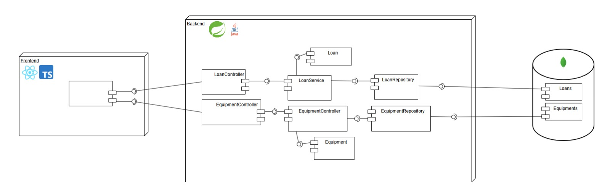
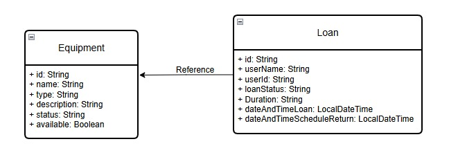
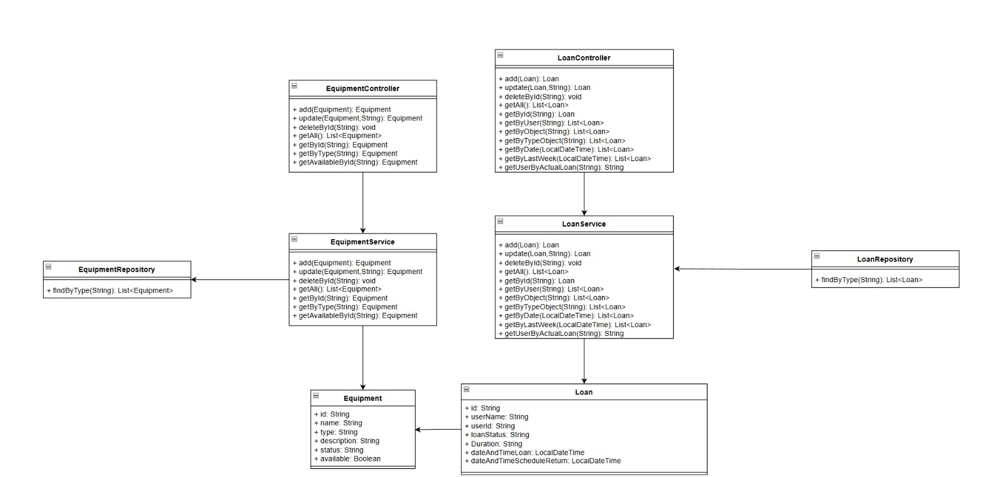

# esmeralda-sports-loans-service
Backend repository responsible for the sports equipment lending module

## Description 

This module allows community members to book and access the
loan of sports equipment available in the coliseum, facilitating both the
request as the return of the items. In turn, the officials of
well-being manage inventory availability and verify the status of
equipment at the time of return, thus guaranteeing proper use of the
institutional resources.

## Technologies Used

-	SpringBoot (Framework de desarrollo)
-	Apache Maven (Herramienta de gestión de proyectos)
-	Java OpenJDk 17.x.x (Lenguaje de programacion)
-	Junit (Pruebas de codigo)
-	Jacoco (Cobertura de pruebas sobre el codigo)
-	SonarQube (Análisis de calidad de codigo)
-	MongoDB (Base de datos)
-   Swagger (Endpoint Documentation)

## Collaborators

- Sebastian Galvis Briceño
- Julian Santiago Cardenas Cubaque
- Jose David Castillo Rodriguez
- Roger Alexander Rodriguez Abril

## Project Structure

```
esmeralda-spotrs-loans-service/
├── pom.xml
├── .gitignore
├── README.md
├── assets/
└── src/
    ├── main/
    │   ├── java/
    │   │   └── edu/eci/cvds/sportsloans/
    │   │       ├── sportsLoansApplication.java
    │   │       ├── config/            # Configuration classes
    │   │       ├── controller/        # REST Controllers
    │   │       ├── dto/               # Data Transfer Objects
    │   │       │   └── enum/          # Enumerations
    │   │       ├── exception/         # Custom Exception Handling
    │   │       ├── model/             # Entity Classes
    │   │       ├── service/           # Business Logic Services
    │   │       └── util/              # Utility classes
    │   └── resources/
    │       ├── application.properties       # Default configuration
    │       ├── application-dev.properties   # Development configuration
    │       ├── application-prod.properties  # Production configuration
    │       ├── static/                      # Static resources
    │       └── templates/                   # Templates
    └── test/
        └── java/
            └── edu/eci/cvds/users/
                └── sportsLoansApplicationTest.java
```
## Diagrams
Here are the diagrams on which we base and base the architecture of the module's operation.

### Components Diagram



### Data Diagram
    


### Class Diagram



## How to run the project

## Actual Working Endpoints

### Equipment

 **Function**                  | **Description**                                                            | **URL**                                                                         |
|------------------------------|----------------------------------------------------------------------------|---------------------------------------------------------------------------------|
| Get all equipment            | Returns a list of all registered equipment.                                | GET http://localhost:8080/api/v1.0/equipment                                    |
| Get equipment by ID          | Returns the details of a specific equipment item identified by its ID.     | GET http://localhost:8080/api/v1.0/equipment/6816caaed00fb27b12b48e1a           |
| Get equipment by type        | Returns a list of all equipment of a specific type (e.g. SoccerBall).      | GET http://localhost:8080/api/v1.0/equipment/type/Audiovisual                   |
| Check equipment availability | Returns whether the specified equipment is currently available for loan.   | GET http://localhost:8080/api/v1.0/equipment/6816caaed00fb27b12b48e1a/available |
| Create new equipment         | Registers new equipment with the information provided in the request body. | POST http://localhost:8080/api/v1.0/equipment                                   |
| Update equipment             | Updates the details of an existing equipment item using its ID.            | PUT http://localhost:8080/api/v1.0/equipment/6818097174d3d03170b7ebea           |
| Delete equipment             | Deletes an equipment item based on its ID.                                 | DELETE http://localhost:8080/api/v1.0/equipment/12345                           |


### Loans:

 **Function**             | **Description**                                                | **URL**                                                              |
|-------------------------|----------------------------------------------------------------|----------------------------------------------------------------------|
| Get All Loans           | Returns a list of all registered loans.                        | GET http://localhost:8080/api/v1.0/loans                             |
| Create a new loan       | Creates a new loan with the data provided in the request body. | POST http://localhost:8080/api/v1.0/loans                            |
| Update an existing loan | Updates the information of an existing loan using its ID.      | PUT http://localhost:8080/api/v1.0/loans/12345                       |
| Delete a loan           | Deletes a specific loan by its ID.                             | DELETE http://localhost:8080/api/v1.0/loans/6818216be8accf68632488ad |
| Get a loan by ID        | Returns the details of a specific loan identified by its ID.   | GET http://localhost:8080/api/v1.0/loans/12345                       |
| Get loans by user       | Lists all loans made by a specific user.                       | GET http://localhost:8080/api/v1.0/loans/user/1234                   |

