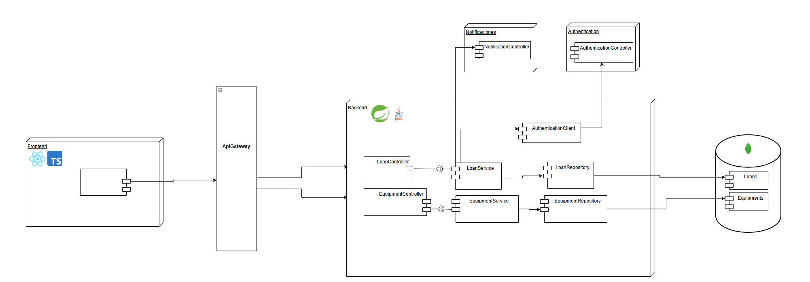

# esmeralda-sports-loans-service
Backend repository responsible for the sports equipment lending module

## Description 

This module allows community members to book and access the
loan of sports equipment available in the coliseum, facilitating both the
request as the return of the items. In turn, the officials of
well-being manage inventory availability and verify the status of
equipment at the time of return, thus guaranteeing proper use of the
institutional resources.

## Technologies Used

-	SpringBoot (Framework de desarrollo)
-	Apache Maven (Herramienta de gestión de proyectos)
-	Java OpenJDk 17.x.x (Lenguaje de programacion)
-	Junit (Pruebas de codigo)
-	Jacoco (Cobertura de pruebas sobre el codigo)
-	SonarQube (Análisis de calidad de codigo)
-	PostGreSQL(Base de datos)

## Collaborators

- Sebastian Galvis Briceño
- Julian Santiago Cardenas Cubaque
- Jose David Castillo Rodriguez
- Roger Alexander Rodriguez Abril

## Project Structure

```
esmeralda-spotrs-loans-service/
├── pom.xml
├── .gitignore
├── README.md
├── assets/
└── src/
    ├── main/
    │   ├── java/
    │   │   └── edu/eci/cvds/sportsloans/
    │   │       ├── sportsLoansApplication.java
    │   │       ├── config/            # Configuration classes
    │   │       ├── controller/        # REST Controllers
    │   │       ├── dto/               # Data Transfer Objects
    │   │       │   └── enum/          # Enumerations
    │   │       ├── exception/         # Custom Exception Handling
    │   │       ├── model/             # Entity Classes
    │   │       ├── service/           # Business Logic Services
    │   │       └── util/              # Utility classes
    │   └── resources/
    │       ├── application.properties       # Default configuration
    │       ├── application-dev.properties   # Development configuration
    │       ├── application-prod.properties  # Production configuration
    │       ├── static/                      # Static resources
    │       └── templates/                   # Templates
    └── test/
        └── java/
            └── edu/eci/cvds/users/
                └── sportsLoansApplicationTest.java
```
## Diagrams
Here are the diagrams on which we base and base the architecture of the module's operation.

### Components Diagram



### Data Diagram
    


### Class Diagram


### Entity Relationship Diagram


